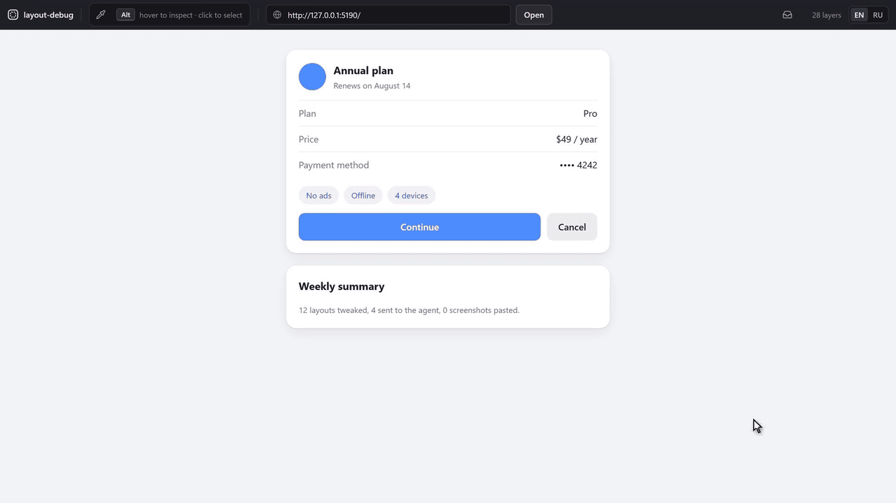
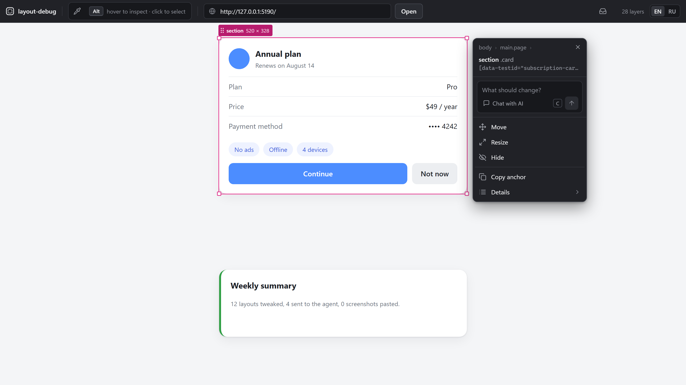
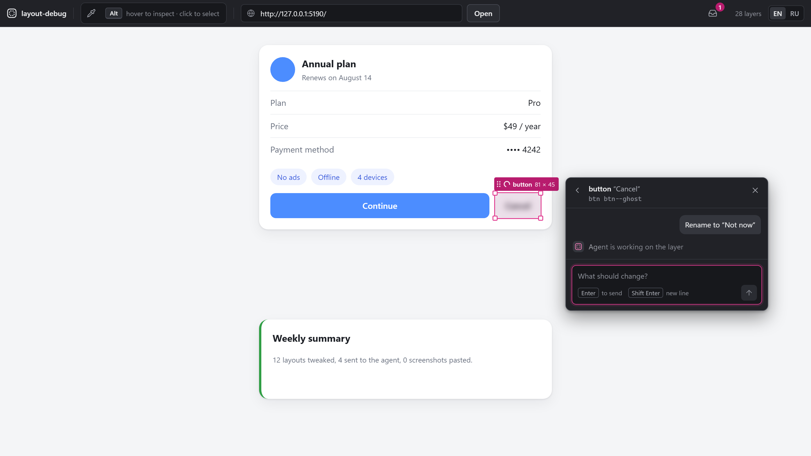
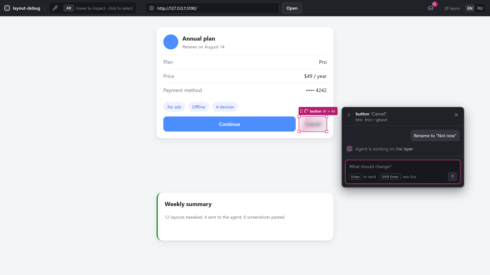
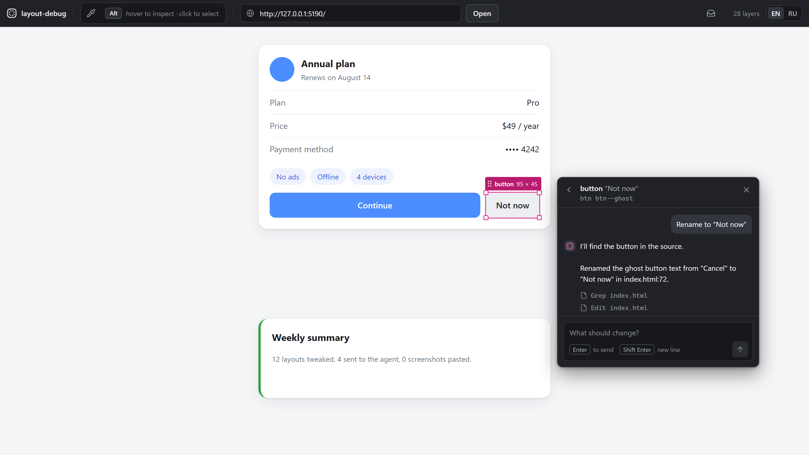
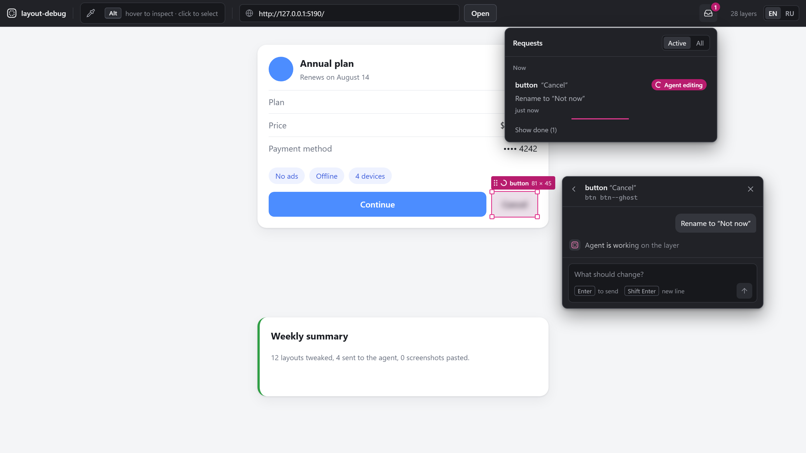

# layout-debug-mcp

[](https://github.com/AntonChuraev99/Layout-debug-mcp/releases)
[](./LICENSE)
[](https://nodejs.org)
[](#roadmap)

**Кликни элемент. Подвинь его. Агент точно знает, какой именно.**

Надоело делать скриншоты UI, обводить кнопку и описывать её AI-агенту словами? Просто укажи на неё. Выделяешь любой слой на работающей странице или в Android-приложении, двигаешь его на настоящем экране и отправляешь правку агенту вместе с якорями элемента, его боксом, родителями и замеренной дельтой.

[](./.github/media/hero.mp4)

<sub>18-секундный цикл, снятый с настоящего инструмента. [MP4 в полном качестве](./.github/media/hero.mp4).</sub>

[English version](./README.md)

> **Что видит инструмент.** Он снимает скриншоты и дерево layout того UI, на который направлен, и отдаёт их подключённому агенту. Не запускай его на экранах с данными, которые не стал бы вставлять в этого агента.

## Зачем

Вёрстка с агентом идёт «по тексту»: описал элемент, агент поправил другой `div`, пересобрал, посмотрел, снова описал. Половина времени уходит на объяснение, *какой именно* элемент имеется в виду.

layout-debug-mcp — локальное окно поверх работающего UI. Элемент выбираешь прямо на картинке, объяснять нечего. Нужно на 16 px ниже — тащишь мышью, и настоящая страница (или телефон) меняется без пересборки. Агент получает замеры, а не прилагательные.

Одно окно, две цели, один формат снапшота:

- **Веб** — любая настоящая DOM-страница с dev-сервера (React, Vue, чистый HTML; строки классов Tailwind — сильные якоря для грепа).
- **Android** — Jetpack Compose / Compose Multiplatform на устройстве или эмуляторе через `adb`: полное дерево композиции с `file:line` от компилятора и живые оверрайды на устройстве без Gradle.

У веба есть прецеденты (Onlook, LocatorJS, code-inspector). Выделить любой слой Compose вместе со строкой исходника и отдать его агенту не умеет даже Layout Inspector в Android Studio.

## Возможности

- **Выделение любого слоя.** Наведение подсвечивает самый тесный бокс под курсором, клик выделяет. Хлебные крошки поднимают к родителям, «Подробнее» опускает к детям. Работает на обёртках и контейнерах, а не только на accessibility-узлах.
- **Живая правка.** Перетаскивание двигает, ручка в углу меняет размер, элемент можно скрыть и вернуть. На вебе это inline-стили, на Android оверрайд применяется к работающей композиции.
- **Передача агенту.** У каждого элемента свой тред чата. Сообщение уходит с артефактами элемента: якоря (`file:line`, test id, id, строка классов, текст), бокс, цепочка родителей, соседи и твои живые правки как замер в `dp` / `css-px` с боксом до и после.
- **Видно, как идёт работа.** Пока агент правит, поверх элемента переливается блюр. Агент ответил — окно само обновляет кадр, восстанавливает выделение и переприменяет остальные живые правки.
- **Входящие.** Все запросы со статусом (в очереди, агент правит, готово, ошибка), шагами агента и временем, плюс ответы, не привязанные к элементу.
- **Два входа.** MCP-сервер (stdio) для любого MCP-клиента или встроенный чат на Claude Agent SDK.
- **Английский и русский интерфейс**, переключатель в шапке.
- **Только локально.** Окно, сервер и MCP-процесс живут на твоей машине. Никакого облака и телеметрии.

## Требования

- Node.js 22.12+ (подойдёт и 20.19+; меньше Vite 7 не поддерживает)
- Chrome, Edge, Firefox или другой современный браузер для окна
- Для Android: `adb` в `PATH` и приложение в **debug**-сборке с агентом на устройстве (см. [Android](#android))

Playwright и его браузеры нужны только для e2e-тестов, для работы инструмента — нет.

## Быстрый старт

Попробовать на встроенной демо-странице, без настройки:

```bash
git clone https://github.com/AntonChuraev99/Layout-debug-mcp.git
cd Layout-debug-mcp
npm install
npm run dev
```

Открой **http://127.0.0.1:5174** — демо уже загружено: наводи, кликай, двигай, пиши комментарий.

`npm run dev` поднимает три процесса: сборку инспектора в watch-режиме, сервер на `127.0.0.1:5175` и окно на `127.0.0.1:5174`. **Держи его запущенным в отдельном терминале всю сессию.** MCP-сервер — тонкий клиент этого сервера и сам по себе ничего не делает.

Порты заняты — `npm run dev` остановится с причиной (например, `port … is already in use`), а не останется запущенным наполовину. Запусти на другой паре, например `LD_UI_PORT=5184 LD_SERVER_PORT=5185 npm run dev` (PowerShell: `$env:LD_UI_PORT='5184'; $env:LD_SERVER_PORT='5185'; npm run dev`). Тот же `LD_SERVER_PORT` потом передай MCP-клиенту, см. ниже.

Дальше [подключи MCP-клиент](#подключение-mcp-клиента), выдели что-нибудь в окне, отправь комментарий и попроси агента: *«возьми правки из pending_requests и внеси их»*.

## Подключение MCP-клиента

MCP-сервер — stdio-процесс из клонированного репозитория. Пути — **абсолютные**: клиенты запускают процесс из своего рабочего каталога, а не из репозитория. Рекомендуемая команда запускает `tsx` самого репозитория через `node`, поэтому на Windows не нужна shell-обёртка, сеть и скачивание:

```
command: node
args:    /abs/path/to/Layout-debug-mcp/node_modules/tsx/dist/cli.mjs
         /abs/path/to/Layout-debug-mcp/src/mcp/index.ts
```

На Windows пиши пути с прямыми слешами (`C:/Users/you/Layout-debug-mcp/...`): все клиенты ниже их понимают, и в JSON ничего не нужно экранировать.

**Сменил порт сервера?** MCP-процесс ищет сервер на `http://127.0.0.1:5175`. Если `npm run dev` запущен с `LD_SERVER_PORT`, передай MCP-процессу то же значение (`env` в сниппетах ниже) или задай `LD_SERVER_URL`.

Клиент может показать сервер подключённым ещё до запуска `npm run dev` — инструменты упадут только при вызове с «server is unreachable». Подключение проверено от начала до конца в Claude Code; остальные сниппеты сверены с текущей документацией каждого клиента.

### Claude Code

```bash
claude mcp add --transport stdio --scope user layout-debug -- node /abs/path/to/Layout-debug-mcp/node_modules/tsx/dist/cli.mjs /abs/path/to/Layout-debug-mcp/src/mcp/index.ts
```

Со своим портом сервера:

```bash
claude mcp add --transport stdio --scope user layout-debug -e LD_SERVER_PORT=5185 -- node /abs/path/to/Layout-debug-mcp/node_modules/tsx/dist/cli.mjs /abs/path/to/Layout-debug-mcp/src/mcp/index.ts
```

Windows, PowerShell или cmd:

```powershell
claude mcp add --transport stdio --scope user layout-debug -- node C:/path/to/Layout-debug-mcp/node_modules/tsx/dist/cli.mjs C:/path/to/Layout-debug-mcp/src/mcp/index.ts
```

Проверка: `claude mcp get layout-debug` печатает `Status: √ Connected`; внутри сессии — `/mcp`. Сервер, добавленный посреди сессии, появится после её перезапуска.

`--scope user` — сервер доступен во всех проектах. `--scope project` запишет его в общий `.mcp.json` проекта — с абсолютным путём это сработает только на твоей машине.

<details>
<summary>Альтернатива: <code>npx tsx</code></summary>

```bash
claude mcp add --transport stdio --scope user layout-debug -- npx tsx /abs/path/to/Layout-debug-mcp/src/mcp/index.ts
```

Тоже работает, но с оговоркой: запущенный не из репозитория, `npx` не видит его `tsx` и при первом запуске скачивает последнюю версию из реестра (нужна сеть, старт на несколько секунд дольше, версия не закреплена lock-файлом). Если клиент на Windows падает с `spawn npx ENOENT`, оберни: `-- cmd /c npx tsx C:/path/...`. В Git Bash пиши `cmd //c`, иначе MSYS превратит `/c` в путь.

</details>

### Cursor

`~/.cursor/mcp.json` (глобально) или `.cursor/mcp.json` (проект):

```json
{
  "mcpServers": {
    "layout-debug": {
      "command": "node",
      "args": [
        "/abs/path/to/Layout-debug-mcp/node_modules/tsx/dist/cli.mjs",
        "/abs/path/to/Layout-debug-mcp/src/mcp/index.ts"
      ],
      "env": { "LD_SERVER_PORT": "5175" }
    }
  }
}
```

Блок `env` необязателен — он здесь, чтобы было видно, куда идёт сменённый порт. Тот же объект `env` работает в конфигах Claude Desktop, Devin Desktop и Gemini CLI.

### VS Code (агентный режим Copilot)

Уровень пользователя (команда **MCP: Open User Configuration** — подходит лучше, путь всё равно абсолютный) или `.vscode/mcp.json` в рабочей области. Ключ — `servers`, `type` обязателен:

```json
{
  "servers": {
    "layout-debug": {
      "type": "stdio",
      "command": "node",
      "args": [
        "/abs/path/to/Layout-debug-mcp/node_modules/tsx/dist/cli.mjs",
        "/abs/path/to/Layout-debug-mcp/src/mcp/index.ts"
      ]
    }
  }
}
```

### Claude Desktop

Settings → Developer → Edit Config открывает `claude_desktop_config.json` (Windows: `%APPDATA%\Claude\`, macOS: `~/Library/Application Support/Claude/`):

```json
{
  "mcpServers": {
    "layout-debug": {
      "command": "node",
      "args": [
        "/abs/path/to/Layout-debug-mcp/node_modules/tsx/dist/cli.mjs",
        "/abs/path/to/Layout-debug-mcp/src/mcp/index.ts"
      ]
    }
  }
}
```

После правки **полностью закрой и перезапусти** Claude Desktop. Логи: `%APPDATA%\Claude\logs\mcp-server-layout-debug.log` на Windows, `~/Library/Logs/Claude/` на macOS.

### Codex CLI

`~/.codex/config.toml` (или `.codex/config.toml` в доверенном проекте; общий для Codex CLI, расширения IDE и десктоп-приложения):

```toml
[mcp_servers.layout-debug]
command = "node"
args = ["/abs/path/to/Layout-debug-mcp/node_modules/tsx/dist/cli.mjs", "/abs/path/to/Layout-debug-mcp/src/mcp/index.ts"]
# env = { LD_SERVER_PORT = "5185" }
```

Или из терминала:

```bash
codex mcp add layout-debug -- node /abs/path/to/Layout-debug-mcp/node_modules/tsx/dist/cli.mjs /abs/path/to/Layout-debug-mcp/src/mcp/index.ts
```

### Devin Desktop (бывший Windsurf), Gemini CLI и другие

Те же `command` / `args` / `env` под `mcpServers`:

- **Devin Desktop** (Windsurf переименован в июне 2026): `~/.config/devin/mcp_config.json` на macOS/Linux, `%APPDATA%\devin\mcp_config.json` на Windows или `.devin/mcp_config.json` в проекте. CLI: `devin mcp add layout-debug -- node <args>`.
- **Gemini CLI**: `~/.gemini/settings.json` (пользователь) или `.gemini/settings.json` (проект). CLI: `gemini mcp add layout-debug node <args>`.

### Инструменты

| Инструмент | Что делает | Параметры |
|---|---|---|
| `layout_snapshot` | Дерево последнего снимка: узлы, размеры, якоря для поиска в коде. Сжато по глубине | `maxDepth` (1–30, по умолчанию 8) |
| `selected_element` | Что пользователь выделил в окне прямо сейчас: бокс, якоря, цепочка родителей, живые правки | нет |
| `pending_requests` | Запросы из окна: `requestId`, комментарий, артефакты элемента, замеры перетаскивания. Новые помечены `[NEW]` | `includeConsumed` (`false`), `markConsumed` (`true`) |
| `reply_in_window` | Пишет в чат окна — что изменено, в каких файлах, что осталось. С `requestId` помечает готовым именно этот запрос | `text`, `role` (`assistant` \| `system`), `requestId` (необязательно) |

Первые три читают состояние, последний его дополняет. Окно закрыто — ответ сохранится и покажется при следующем открытии, так что порядок «сначала агент, потом окно» работает.

MCP работает по запросу: сам агент о новых правках не узнаёт. Каждый раз проси его забрать pending_requests или пользуйся встроенным чатом.

## Как пользоваться окном

<p>
  
  
</p>

Снимки сделаны в английском интерфейсе; в русском всё то же самое.

### Выделение слоя

Режимов нет: на вебе страница остаётся живой — клики, прокрутка и ввод уходят в неё. Слой выделяется поверх:

| Действие | Что делает |
|---|---|
| Зажать `Alt` (`⌥ Option` на macOS) | Подсвечивает самый тесный бокс под курсором; подсказка в шапке загорается, у курсора появляется пузырь «Выбрать для чата» |
| `Alt`+клик | Выделяет слой и открывает палитру действий. Повторный `Alt`+клик в том же месте — к родителю |
| `Alt`+колесо | Вверх к родителю / обратно к самому тесному слою под курсором |
| Пипетка (шапка) | Выделяет один слой без клавиши и выключается сама |
| Тянуть выделенный слой | Двигает элемент **в самой странице / на устройстве**; ручки по углам меняют размер. Слой почти на весь кадр тянется за ярлык — страница под ним остаётся кликабельной |
| `Esc` или ✕ в палитре | Снимает выделение |

Клик вне выделенного слоя уходит в страницу, выделение остаётся. На Android окно пока не передаёт клики на устройство, поэтому там обычное наведение подсвечивает, а обычный клик выделяет.

Когда фокус на кадре: `Enter` — к первому ребёнку, `Shift+Enter` — к родителю, `Tab` / `Shift+Tab` — к соседям. `Esc` по очереди закрывает подсказку первого запуска, чат, «Подробнее», сдвиг стрелками и пипетку, затем снимает выделение. Сочетания работают и в русской раскладке.

На вебе в шапке есть поле **адреса страницы**: вставь адрес любого dev-сервера и нажми «Открыть».

### Палитра действий

Появляется рядом с выделенным элементом, сверху — хлебные крошки родителей:

| Действие | Что делает |
|---|---|
| Поле сообщения (`C`) | Всегда открыто под заголовком: напиши правку и нажми `Enter` — она уходит агенту, и открывается чат элемента с ответом. `C` ставит курсор в поле; выделение элемента курсор не ставит, клавиши кадра продолжают работать. `Esc` при набранном тексте выводит из поля и сохраняет черновик |
| Чат с ИИ | Под полем, со счётчиком прошлых правок: открывает тред элемента (история и ответы) |
| Передвинуть | Сдвиг стрелками: 1 единица, с `Shift` — 8; `Enter` завершает. Тянуть мышью можно и без этого. Сдвинутый элемент оставляет на старом месте бледную копию, пока правку не сбросят |
| Изменить размер | Ширина и высота стрелками; ручки по углам работают и без этого |
| Скрыть / Показать | Скрывает элемент, его место сохраняется (пока только веб) |
| Копировать якорь | Копирует лучший якорь для поиска в коде (`file:line`, дальше test id, id, строка классов, путь) |
| Сбросить правки | Возвращает элемент к тому, что в коде |
| Не ждать агента | Снимает метку «агент правит», если агент так и не ответил |
| Подробнее | Бокс, исходник, классы, путь, живые правки и список детей «Внутри» |

### Чат элемента, блюр и автообновление

<p>
  
  
</p>

1. Выдели элемент, нажми `C`, опиши правку, `Enter` — отправить (`Shift+Enter` — новая строка). Живые правки этого элемента уходят вместе с сообщением как замеры.
2. Если задан `projectDir`, запрос берёт встроенный агент. Если нет — запрос **встаёт в очередь для MCP**, на элементе появляется метка «в очереди».
3. Пока агент работает, поверх элемента переливается блюр.
4. Агент ответил (`reply_in_window` с `requestId` или встроенный чат закончил) — окно ждёт около 1,5 с горячей перезагрузки dev-сервера. Если кадр не обновился, перезагружает страницу (Android — берёт свежий кадр), восстанавливает выделение по якорю, переприменяет остальные живые правки и убирает блюр. Ответ появляется в треде элемента.

### Входящие



Иконка «Входящие» в шапке показывает счётчик открытых запросов. Внутри — все запросы со статусом (в очереди, агент правит, готово, ошибка), шагами агента и временем, ответы без привязки к элементу и ошибки агента со следующим шагом (например, как войти, если встроенный агент не может достучаться до Claude). Фильтр: «Активные» или «Все».

### Язык

По умолчанию окно на английском. Переключатель `EN | RU` в шапке включает русский; выбор хранится в браузере, сообщения сервера следуют за ним. Ответы MCP-инструментов и промпты агента остаются на английском; агент отвечает на языке твоего комментария.

## Подключение своего веб-проекта

1. Добавь инспектор на страницу, **только в dev**:

   ```html
   <script src="http://127.0.0.1:5175/inspector.js"></script>
   ```

   Если менял `LD_SERVER_PORT` — подставь его. Скрипт общается только с родительским окном (UI инструмента) и больше никуда ничего не шлёт.

2. Скопируй `layout-debug.config.example.json` в `layout-debug.config.json` в каталоге инструмента:

   ```json
   {
     "targetUrl": "http://localhost:3000",
     "projectDir": "/abs/path/to/my-web-app"
   }
   ```

   `projectDir` — репозиторий, который встроенному чат-агенту разрешено править. Без него встроенный чат выключен, а правки копятся в очереди для MCP.

Для source mapping добавь в сборку шаг, который дописывает JSX-элементам `data-source-loc="file:line"`; без него агент ищет элемент по `data-testid`, id и строке классов.

## Android

Агент на устройстве — небольшой debug-only компонент: обходит настоящее дерево Compose через `ui-tooling` (`asTree()` отдаёт боксы и source-информацию компилятора), отдаёт его вместе со скриншотом `PixelCopy` по HTTP и применяет живые оверрайды, подменяя модификатор `LayoutNode` в работающей композиции. Инструмент достаёт до него через `adb forward`, который ставит и переустанавливает сам. Скриншот и дерево приходят одним вызовом, поэтому всегда совпадают.

> **Статус:** агент работает в приложении, на котором делался спайк, и **ещё не упакован в библиотеку**. Публикация в Maven Central как одна строка `debugImplementation` — следующий Android-этап. До тех пор Android-режим — для ранних тестировщиков.

Запуск в Android-режиме:

```bash
LD_TARGET=android LD_DEVICE=emulator-5554 LD_PROJECT_DIR=/abs/path/to/my-app npm run dev
```

PowerShell:

```powershell
$env:LD_TARGET='android'; $env:LD_DEVICE='emulator-5554'; $env:LD_PROJECT_DIR='C:/path/to/my-app'; npm run dev
```

`LD_DEVICE` нужен, только если устройств больше одного. Приложение должно быть запущено в debug-сборке.

В Android-режиме вместо iframe окно показывает кадр устройства с тем же оверлеем, выделением, перетаскиванием и сбросом. Кадр обновляется сам (пауза на время перетаскивания, реже — когда снимки не удаются), чип в шапке показывает модель устройства. Первый снапшот сессии сбрасывает живые оверрайды на устройстве, чтобы не оставались старые от прошлого окна.

## Настройки

Переменные окружения перебивают `layout-debug.config.json` (в корне клонированного инструмента), он перебивает значения по умолчанию.

| Переменная | Ключ конфига | По умолчанию | Смысл |
|---|---|---|---|
| `LD_TARGET` | `target` | `web` | `web` или `android` |
| `LD_TARGET_URL` | `targetUrl` | встроенное демо | Страница для инспекции (веб) |
| `LD_PROJECT_DIR` | `projectDir` | нет | Репозиторий, который может править встроенный чат; не задан — встроенный чат выключен, правки идут в очередь MCP |
| `LD_DEVICE` | `device` | нет | serial для `adb -s` (android) |
| `LD_ANDROID_PORT` | `androidPort` | `8790` | Порт агента на устройстве (android) |
| `LD_UI_PORT` | нет | `5174` | Порт окна |
| `LD_SERVER_PORT` | нет | `5175` | Порт сервера; его же читает MCP-процесс |
| `LD_SERVER_URL` | нет | `http://127.0.0.1:5175` | Где MCP-процесс ищет сервер (там перебивает `LD_SERVER_PORT`) |

Порты должны различаться; неверное значение роняет старт с сообщением, а не подменяется значением по умолчанию.

## Как устроено

```
 целевая страница / Android-app     твоя машина
 ┌────────────────────┐   postMessage / adb forward   ┌──────────────────────┐
 │ инспектор / агент  │ ◄───────────────────────────► │ сервер 127.0.0.1:5175│
 └────────────────────┘                               │ снапшот · выделение  │
                                                      │ очередь правок       │
          ┌──────────────┐        WebSocket           └───┬──────────────┬───┘
          │ окно :5174   │ ◄──────────────────────────────┘ локальный HTTP│
          │ кадр+оверлей │                                ┌──────────────▼───┐
          │ чат · входящ.│                                │ MCP stdio-сервер │ ◄── твой агент
          └──────────────┘                                └──────────────────┘
```

Оба адаптера отдают один нормализованный снапшот: узлы с боксами в пикселях кадра, `pxPerUnit` для перевода в `dp` / `css-px`, якоря (`sourceLoc`, test id, классы, текст) и плоский мешок платформенных свойств. UI, чат и MCP не знают, с какой платформы пришли данные. Архитектурные решения и история спайков — в [CLAUDE.md](./CLAUDE.md).

Статус каждого запроса (`queued`, `working`, `done`, `error`) ведёт сервер и шлёт его в окно с типизированными кодами ошибок, так что окно не угадывает состояние по тексту сообщений.

## Безопасность

- Сервер слушает только `127.0.0.1` и проверяет `Origin` и `Host` у HTTP- и WebSocket-запросов: открытая в браузере страница не может им управлять, в том числе через DNS rebinding.
- Встроенному чат-агенту разрешены только `Read`, `Edit`, `Write`, `Grep`, `Glob`; запись ограничена `projectDir`, `.git/`, `.claude/`, `.mcp.json` и `.env*` закрыты. Агент грузит настройки и `CLAUDE.md` проекта, но не твои пользовательские настройки Claude Code. Чтение пока не ограничено — известные пробелы в [SECURITY.md](./SECURITY.md).
- С машины уходит только то, что получает подключённый агент: через MCP — агент твоего клиента, через встроенный чат — Claude через Claude Agent SDK.
- Веб-инспектор подключается только в dev. Android-агент живёт в debug source set; в приложении спайка пока остаётся небольшой инертный мост в основном source set — библиотека разделит его на артефакты `-agent` / `-noop`.

Нашёл уязвимость — см. [SECURITY.md](./SECURITY.md).

## Ограничения

- Живые правки — **превью**, а не код: они исчезают при перезагрузке страницы или пересборке приложения, пока агент не впишет их в исходник.
- MCP работает по запросу. Правка в очереди MCP остаётся в статусе «Агент правит», пока агент не ответит с её `requestId` или пока не нажмёшь «Не ждать агента».
- На npm 11 `npm install` может показать предупреждение `allow-scripts` про `esbuild` — оно безвредно (бинарь приходит из платформенного пакета esbuild).
- **Веб:** страница открывается в `iframe` — цель с `X-Frame-Options` / `frame-ancestors` не отрисуется. Снимок дерева обрезается на 4000 узлах и синхронизируется не чаще раза в секунду. Для `file:line` нужен свой шаг сборки с `data-source-loc` (плагина в комплекте пока нет). В поле ввода внутри закрытого shadow root (`mode: 'closed'`) клавиши C и Esc печатаются, но заодно доходят до окна (открывают чат, снимают выделение): снаружи такое поле не отличить от обычного элемента.
- **Android:** кадр — обновляемый снимок, а не видеопоток. Двигается выделенный узел: выделишь внутренний `Row` — уедет содержимое, фон останется на месте, поднимись по хлебным крошкам. Скрытие пока недоступно. Оверрайд живёт до рекомпозиции этого composable; инструмент переприменяет активные правки после каждого обновления дерева. `@UiToolingDataApi` не гарантирует совместимость; проверено на Compose Multiplatform 1.11 / Kotlin 2.3.20. Текста элемента в артефактах пока нет — `asTree()` не отдаёт его без разбора параметров; якорь `file:line` и так точнее.

## Если не работает

| Симптом | Что проверить |
|---|---|
| MCP-инструменты отвечают «server is unreachable at …» | В сообщении есть адрес, по которому шёл запрос, сетевая ошибка и переменная, из которой взят адрес. Не запущен — запусти `npm run dev`. Запущен с другим `LD_SERVER_PORT` — пропиши то же значение (или `LD_SERVER_URL`) в `env` MCP-сервера в конфиге клиента и перезапусти сессию. `curl http://127.0.0.1:5175/api/health` отдаёт `{"ok":true,…}` |
| Окно показывает «Окно не запустилось» | Строка причины говорит, что сломалось (не загрузился скрипт окна или ничего не отрисовалось за 15 с). Проверь, что `npm run dev` всё ещё работает в своём терминале и не пишет ошибок, затем нажми «Обновить страницу» |
| Клиент не видит сервер | Пути в конфиге абсолютные; `node -v` — 20.19+ / 22.12+ в окружении, из которого стартует клиент. GUI-приложения, запущенные из меню «Пуск» или Dock, могут не видеть Node из nvm / Volta / fnm — укажи абсолютный путь к `node` в `command`. Перезапусти сессию (Claude Desktop — закрыть полностью) |
| Windows: `spawn npx ENOENT` | Форма `node …/tsx/dist/cli.mjs` или обёртка `cmd /c npx …` |
| Окно пишет, что инспектор не отозвался | Тег скрипта есть в странице, цель разрешает встраивание (`X-Frame-Options`, CSP `frame-ancestors`), CSP `script-src` пускает `127.0.0.1:5175` |
| Во «Входящих» «Агент не может войти в Claude» | У встроенного чата нет учётных данных: выполни `claude login` в терминале или задай серверу `ANTHROPIC_API_KEY`, перезапусти его, отправь снова |
| Android: «adb не найден» / «Устройство не подключено» | `adb devices` показывает ровно одно устройство со статусом `device` (или задан `LD_DEVICE`); окно подхватит его без перезагрузки |
| Android: «Устройство есть, приложение молчит» | Приложение запущено в debug-сборке с агентом, который слушает `LD_ANDROID_PORT` (8790) |

## Roadmap

До 1.0. Ближайшее:

1. Android-агент как опубликованная библиотека (Maven Central, `debugImplementation`, разделение `-agent` / `-noop`).
2. Установка одной командой: `npx layout-debug-mcp` для окна и `npx -y layout-debug-mcp mcp` для MCP-клиентов, карточка в официальном MCP Registry и плагин Claude Code.
3. Проверка установки на чистых машинах (Windows, macOS, Linux) в Claude Code, Cursor, VS Code и Codex CLI; CI.
4. Живой видеопоток с устройства через scrcpy (H.264, декодирование в браузере через WebCodecs) вместо обновляемых снимков.

Позже, по запросу: сравнение снапшотов до/после, плагин source location для Vite/Babel, Compose Desktop, Android Views, Flutter.

## Участие

См. [CONTRIBUTING.md](./CONTRIBUTING.md), [CODE_OF_CONDUCT.md](./CODE_OF_CONDUCT.md) и [CHANGELOG.md](./CHANGELOG.md). Баги и идеи — в [issues](https://github.com/AntonChuraev99/Layout-debug-mcp/issues).

## Лицензия

[MIT](./LICENSE)
